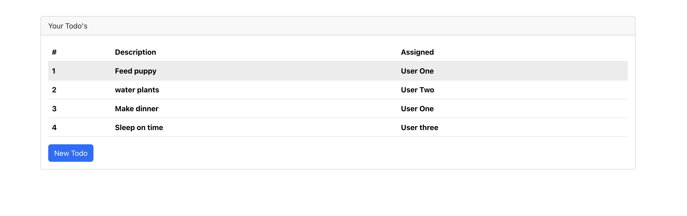

# React ToDoList Demo



This project is a simple to-do list implemented using React. It serves as a great starting point for learning the fundamental features of React. If you're new to React or looking for a basic example to get started with, you're in the right place.

## Features

- Add new tasks to the to-do list.
- Mark tasks as complete.
- Delete tasks from the list.

## Getting Started

Follow these steps to get the project up and running on your local machine.

### Prerequisites

You'll need the following software installed on your machine:

- [Node.js](https://nodejs.org/) - JavaScript runtime
- [npm](https://www.npmjs.com/) - Node.js package manager

### Installation

1. Clone the repository to your local machine:

   ```bash
   https://github.com/Garrick-Guo/react-Todo-Demo.git
   ```

2. Change your working directory to the project folder:
   ```bash
    cd React-ToDoList-Demo
   ```
3. Install the project dependencies using npm
   ```bash
   npm install
   ```
4. Start the development server:
   ```bash
   npm start

